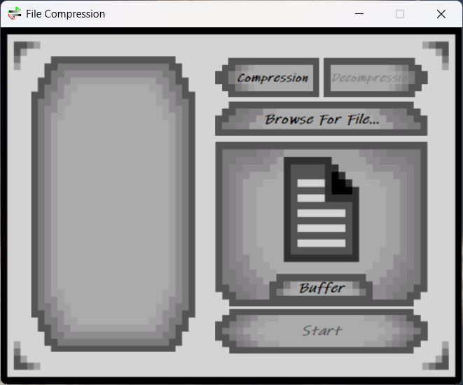

# Huffman Compression Tool

A lightweight, efficient desktop utility for compressing and decompressing files using a custom implementation of the Huffman Coding algorithm. The core compression engine is built in high-performance C++, seamlessly paired with a responsive, modern desktop User Interface engineered in C#.

## Tech Stack
* **Core Logic Engine:** C++
* **User Interface:** C# (.NET Desktop / Windows Forms or WPF)
* **Algorithmic Base:** Greedy Algorithms, Huffman Coding

## Key Features

* **Custom Data Structures:** Implemented custom binary tree architectures, priority queues (min-heaps), and hash maps from scratch to generate internal frequency tables and prefix codes.
* **Bit-Level Manipulation:** Features custom byte-stream serialization and deserialization, converting variable-length prefix codes into packed bits for maximum data density.
* **Seamless Language Interoperability:** Uses a dynamic C++ execution backend mapped directly to a polished C# graphical interface for smooth file picking and real-time processing tracking.
* **Lossless Compression Pipeline:** Guarantees absolute data integrity across diverse file extensions (.txt, .bin, etc.), successfully minimizing heavy text volumes down to lightweight packages.

## How to Run

1. Clone this repository.
2. Open the solution file (`.sln`) in Visual Studio.
3. Build the project under the `Release` configuration.
4. Run the executable to open the graphical user interface.

## Contributors

* **Yousuf Islam** - [fyseo](https://github.com/fyseo)
* **Abdulrehman-Hatem** - [Hatem's GitHub](https://github.com/Abdulrehman-Hatem)